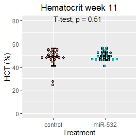
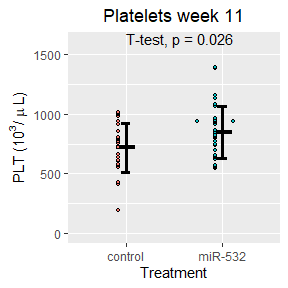
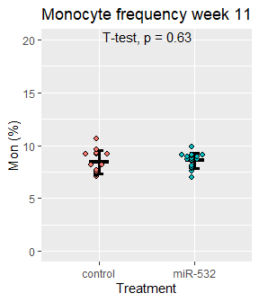
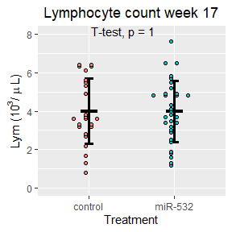
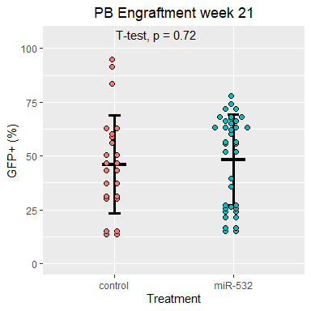
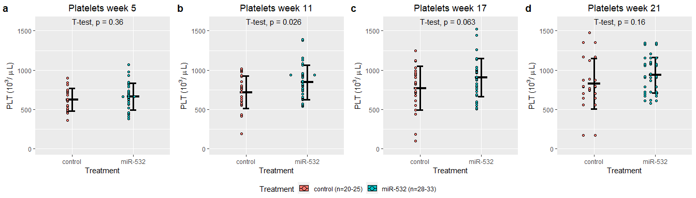

Let's begin by importing our data:


Next lets attach the different peripheral blood data together:

```
##   ï..Sample          Original.label Treatment Weeks.post.transplant WBC  RBC
## 1     MIG.1 BMT1.MIG (NEP cage 1/2)   control                     5 5.2 9.57
## 2     MIG.2 BMT1.MIG (REP cage 1/2)   control                     5 3.6 9.37
## 3     MIG.3 BMT1.MIG (BEP cage 2/2)   control                     5 6.5 9.58
## 4     MIG.4 BMT1.MIG (REP cage 2/2)   control                     5 6.2 9.74
## 5     MIG.5 BMT2.MIG (cage 2/2 BEP)   control                     5 4.5 9.84
## 6     MIG.6 BMT2.MIG (cage 2/2 LEP)   control                     5 3.0 9.83
##    HGB  HCT MCV  MCH MCHC PLT MPV  RDW Percent.Lym Percent.Mon Percent.Gra
## 1 14.7 45.7  48 15.4 32.2 473 6.8 15.7          NA          NA          NA
## 2 14.3 43.0  46 15.3 33.3 605 6.5 15.5          NA          NA          NA
## 3 14.6 44.4  46 15.3 32.9 453 6.7 15.3          NA          NA          NA
## 4 15.1 45.7  47 15.5 33.1 540 7.3 15.3          NA          NA          NA
## 5 14.6 45.8  46 14.9 32.0 631 6.5 16.0          NA          NA          NA
## 6 14.4 44.8  46 14.6 32.2 900 6.0 15.8          NA          NA          NA
##   Number.Lym Number.Mon Number.Gra  GFP
## 1        2.3        0.3        2.6 85.2
## 2        2.1        0.3        1.2 86.8
## 3        3.0        0.5        3.0 88.7
## 4        3.6        0.5        2.1 87.8
## 5        2.6        0.4        1.5 82.3
## 6        1.4        0.2        1.4 82.2
```


<!-- -->


<!-- -->


<!-- -->


<!-- -->


<!-- -->


<!-- -->


<!-- -->

<!-- -->

<!-- -->

<!-- -->

<!-- -->

<!-- -->

<!-- -->

<!-- -->

<!-- -->

<!-- -->

<!-- -->


<!-- -->

<!-- -->

<!-- -->

<!-- -->


<!-- -->

<!-- -->

<!-- -->

<!-- -->

<!-- -->

<!-- -->

<!-- -->


<!-- -->

<!-- -->

<!-- -->

<!-- -->

<!-- -->

<!-- -->

<!-- -->


<!-- -->


<!-- -->


<!-- -->


<!-- -->


<!-- -->


<!-- -->

<!-- -->

<!-- -->

<!-- -->

<!-- -->

<!-- -->

<!-- -->

<!-- -->

<!-- -->

<!-- -->

<!-- -->

<!-- -->


<!-- -->


<!-- -->


<!-- -->


<!-- -->


<!-- -->


<!-- -->

<!-- -->

<!-- -->

<!-- -->

<!-- -->

<!-- -->

<!-- -->

<!-- -->

<!-- -->

<!-- -->

<!-- -->


<!-- --><!-- --><!-- --><!-- --><!-- --><!-- --><!-- --><!-- --><!-- --><!-- --><!-- --><!-- --><!-- --><!-- -->
