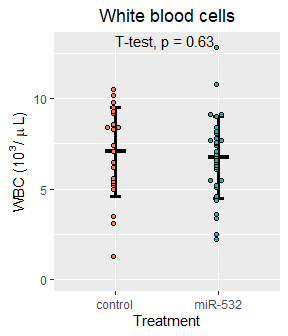
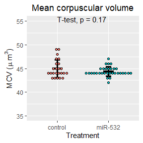
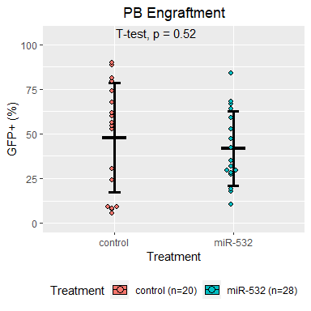

Let's begin by importing our data:


Next lets attach the different peripheral blood data together:

```
##   ï..Sample          Original.label Treatment Weeks.post.transplant WBC  RBC
## 1     MIG.1 BMT1.MIG (NEP cage 1/2)   control                     5 5.2 9.57
## 2     MIG.2 BMT1.MIG (REP cage 1/2)   control                     5 3.6 9.37
## 3     MIG.3 BMT1.MIG (BEP cage 2/2)   control                     5 6.5 9.58
## 4     MIG.4 BMT1.MIG (REP cage 2/2)   control                     5 6.2 9.74
## 5     MIG.5 BMT2.MIG (cage 2/2 BEP)   control                     5 4.5 9.84
## 6     MIG.6 BMT2.MIG (cage 2/2 LEP)   control                     5 3.0 9.83
##    HGB  HCT MCV  MCH MCHC PLT MPV  RDW Percent.Lym Percent.Mon Percent.Gra
## 1 14.7 45.7  48 15.4 32.2 473 6.8 15.7          NA          NA          NA
## 2 14.3 43.0  46 15.3 33.3 605 6.5 15.5          NA          NA          NA
## 3 14.6 44.4  46 15.3 32.9 453 6.7 15.3          NA          NA          NA
## 4 15.1 45.7  47 15.5 33.1 540 7.3 15.3          NA          NA          NA
## 5 14.6 45.8  46 14.9 32.0 631 6.5 16.0          NA          NA          NA
## 6 14.4 44.8  46 14.6 32.2 900 6.0 15.8          NA          NA          NA
##   Number.Lym Number.Mon Number.Gra  GFP
## 1        2.3        0.3        2.6 85.2
## 2        2.1        0.3        1.2 86.8
## 3        3.0        0.5        3.0 88.7
## 4        3.6        0.5        2.1 87.8
## 5        2.6        0.4        1.5 82.3
## 6        1.4        0.2        1.4 82.2
```

We will make a copy of the total data for manipulation:

What are the dimensions of our data?

```
## [1] 410  21
```

# Peripheral bleeds 11 weeks post-transplant:
Next we will filter for CBC data at 11 weeks post-transplant

```
##     ï..Sample   Original.label Treatment Weeks.post.transplant WBC   RBC  HGB
## 348    MIG.17 PL_miR BMT_MIG_1   control                    17 6.5 12.60 16.0
## 349    MIG.18 PL_miR BMT_MIG_2   control                    17 7.4 12.33 15.6
## 350    MIG.19 PL_miR BMT_MIG_3   control                    17 9.2 11.25 16.8
## 351    MIG.20 PL_miR BMT_MIG_4   control                    17 8.3 12.69 16.6
## 352    MIG.21 PL_miR BMT_MIG_5   control                    17 8.5 12.28 17.0
## 353    MIG.22 PL_miR BMT_MIG_6   control                    17 9.5 11.29 16.3
##      HCT MCV  MCH MCHC  PLT MPV  RDW Percent.Lym Percent.Mon Percent.Gra
## 348 53.7  43 12.7 29.8 1028 6.1 15.8        76.9         8.0        15.1
## 349 53.5  43 12.6 29.1 1245 6.5 16.7        77.1         7.4        15.5
## 350 54.7  49 14.9 30.7  968 6.2 16.1        60.1         7.3        32.6
## 351 54.4  43 13.1 30.6 1116 6.5 17.0        34.2         5.1        60.7
## 352 55.6  45 13.8 30.5  906 6.2 16.0        73.0         7.6        19.4
## 353 52.8  47 14.4 30.9  614 6.7 17.0        67.4         9.1        23.5
##     Number.Lym Number.Mon Number.Gra   GFP
## 348        4.9        0.5        1.1 67.50
## 349        5.6        0.5        1.3 54.60
## 350        5.5        0.6        3.1 56.30
## 351        2.8        0.4        5.1  7.71
## 352        6.1        0.6        1.8 30.50
## 353        6.3        0.8        2.4 81.40
```

Let's check the dimensions of our subsetted data:

```
## [1] 58 21
```

Let's make dotplots for our CBC counts:

<!-- -->


<!-- -->


<!-- -->


<!-- -->


<!-- -->


<!-- -->


<!-- -->

<!-- -->

<!-- -->

<!-- -->


<!-- -->


<!-- -->


<!-- -->


<!-- -->


<!-- -->


<!-- -->

<!-- -->


### Now let's arrange the plots:
#### Figure 1
<!-- -->

#### Figure 2
<!-- -->

### Notes
The four miR-532 mice with high granulocytes and lower peripheral blood engraftment (37-45% GFP+) at week 5:

At week5  
ID, GFP+ %, Lym, Mon, Gra  
miR532-29, 43.2,  1.8, 0.9, 7.5  
miR532-14, 45.5, 1.1, 0.3, 5.6  
miR532-30, 37.4, 2.0, 0.8, 4.3  
miR532-8, 44.3, 0.9, 0.2, 4.0  

At week11  
ID, GFP+ %, Lym, Mon, Gra  
miR532-29,  
miR532-14, 43.1, 3.0, 0.5, 5.8  
miR532-30,  
miR532-8, 55.0, 2.3, 0.4, 2.6   


## Now lets separate the data based on the transplanter:

We begin by joining the metadata to the week 11 CBC data


First, let's take a look at our statistics

```
## # A tibble: 3 x 8
##   term     group1      group2     estimate conf.low conf.high p.adj p.adj.signif
## * <chr>    <chr>       <chr>         <dbl>    <dbl>     <dbl> <dbl> <chr>       
## 1 Transpl~ Jeff.Lam    Marion.va~     2.97    0.328      5.61 0.025 *           
## 2 Transpl~ Jeff.Lam    Patrick.L~     1.34   -0.635      3.32 0.231 ns          
## 3 Transpl~ Marion.van~ Patrick.L~    -1.62   -4.34       1.10 0.318 ns
```

```
## # A tibble: 3 x 8
##   term    group1     group2    estimate conf.low conf.high    p.adj p.adj.signif
## * <chr>   <chr>      <chr>        <dbl>    <dbl>     <dbl>    <dbl> <chr>       
## 1 Transp~ Jeff.Lam   Marion.v~   1.59      0.842     2.35   3.87e-5 ****        
## 2 Transp~ Jeff.Lam   Patrick.~   1.69      1.12      2.25   1.17e-7 ****        
## 3 Transp~ Marion.va~ Patrick.~   0.0917   -0.684     0.867  9.54e-1 ns
```

```
## # A tibble: 3 x 8
##   term    group1     group2     estimate conf.low conf.high   p.adj p.adj.signif
## * <chr>   <chr>      <chr>         <dbl>    <dbl>     <dbl>   <dbl> <chr>       
## 1 Transp~ Jeff.Lam   Marion.va~   1.47      0.534     2.40  1.54e-3 **          
## 2 Transp~ Jeff.Lam   Patrick.L~   1.48      0.784     2.18  3.82e-5 ****        
## 3 Transp~ Marion.va~ Patrick.L~   0.0167   -0.945     0.978 9.99e-1 ns
```

```
## # A tibble: 3 x 8
##   term    group1     group2    estimate conf.low conf.high    p.adj p.adj.signif
## * <chr>   <chr>      <chr>        <dbl>    <dbl>     <dbl>    <dbl> <chr>       
## 1 Transp~ Jeff.Lam   Marion.v~     8.       4.96     11.0   1.19e-6 ****        
## 2 Transp~ Jeff.Lam   Patrick.~     7.75     5.47     10.0   8.70e-9 ****        
## 3 Transp~ Marion.va~ Patrick.~    -0.25    -3.38      2.88  9.79e-1 ns
```

```
## # A tibble: 3 x 8
##   term     group1      group2     estimate conf.low conf.high p.adj p.adj.signif
## * <chr>    <chr>       <chr>         <dbl>    <dbl>     <dbl> <dbl> <chr>       
## 1 Transpl~ Jeff.Lam    Marion.va~    0.600   -0.656     1.86  0.474 ns          
## 2 Transpl~ Jeff.Lam    Patrick.L~    0.217   -0.725     1.16  0.838 ns          
## 3 Transpl~ Marion.van~ Patrick.L~   -0.383   -1.68      0.911 0.747 ns
```

```
## # A tibble: 3 x 8
##   term    group1     group2     estimate conf.low conf.high   p.adj p.adj.signif
## * <chr>   <chr>      <chr>         <dbl>    <dbl>     <dbl>   <dbl> <chr>       
## 1 Transp~ Jeff.Lam   Marion.va~   -0.747   -1.29     -0.207 5.25e-3 **          
## 2 Transp~ Jeff.Lam   Patrick.L~   -0.772   -1.18     -0.367 1.66e-4 ***         
## 3 Transp~ Marion.va~ Patrick.L~   -0.025   -0.582     0.532 9.93e-1 ns
```

```
## # A tibble: 3 x 8
##   term    group1     group2    estimate conf.low conf.high    p.adj p.adj.signif
## * <chr>   <chr>      <chr>        <dbl>    <dbl>     <dbl>    <dbl> <chr>       
## 1 Transp~ Jeff.Lam   Marion.v~    -2.27   -2.91     -1.62  4.42e- 9 ****        
## 2 Transp~ Jeff.Lam   Patrick.~    -2.03   -2.51     -1.54  9.06e-11 ****        
## 3 Transp~ Marion.va~ Patrick.~     0.24   -0.425     0.905 6.50e- 1 ns
```

```
## # A tibble: 3 x 8
##   term     group1     group2     estimate conf.low conf.high  p.adj p.adj.signif
## * <chr>    <chr>      <chr>         <dbl>    <dbl>     <dbl>  <dbl> <chr>       
## 1 Transpl~ Jeff.Lam   Marion.va~   -257.    -552.       38.1 0.0971 ns          
## 2 Transpl~ Jeff.Lam   Patrick.L~    -17.6   -239.      204.  0.979  ns          
## 3 Transpl~ Marion.va~ Patrick.L~    240.     -64.8     544.  0.145  ns
```

```
## # A tibble: 3 x 8
##   term     group1     group2     estimate conf.low conf.high  p.adj p.adj.signif
## * <chr>    <chr>      <chr>         <dbl>    <dbl>     <dbl>  <dbl> <chr>       
## 1 Transpl~ Jeff.Lam   Marion.va~   0.373   -0.0529    0.800  0.0948 ns          
## 2 Transpl~ Jeff.Lam   Patrick.L~   0.0233  -0.296     0.343  0.982  ns          
## 3 Transpl~ Marion.va~ Patrick.L~  -0.35    -0.789     0.0894 0.138  ns
```

```
## # A tibble: 3 x 8
##   term     group1     group2     estimate conf.low conf.high  p.adj p.adj.signif
## * <chr>    <chr>      <chr>         <dbl>    <dbl>     <dbl>  <dbl> <chr>       
## 1 Transpl~ Jeff.Lam   Marion.va~   -0.673   -1.55      0.203 0.157  ns          
## 2 Transpl~ Jeff.Lam   Patrick.L~    0.467   -0.190     1.12  0.203  ns          
## 3 Transpl~ Marion.va~ Patrick.L~    1.14     0.237     2.04  0.0111 *
```

```
## # A tibble: 3 x 8
##   term    group1     group2     estimate conf.low conf.high   p.adj p.adj.signif
## * <chr>   <chr>      <chr>         <dbl>    <dbl>     <dbl>   <dbl> <chr>       
## 1 Transp~ Jeff.Lam   Marion.va~    2.45     0.938      3.96 1.12e-3 **          
## 2 Transp~ Jeff.Lam   Patrick.L~    2.05     0.919      3.18 3.12e-4 ***         
## 3 Transp~ Marion.va~ Patrick.L~   -0.397   -1.95       1.16 8.05e-1 ns
```

```
## # A tibble: 3 x 8
##   term     group1     group2     estimate conf.low conf.high  p.adj p.adj.signif
## * <chr>    <chr>      <chr>         <dbl>    <dbl>     <dbl>  <dbl> <chr>       
## 1 Transpl~ Jeff.Lam   Marion.va~   0.273    0.0325    0.514  0.0236 *           
## 2 Transpl~ Jeff.Lam   Patrick.L~   0.0617  -0.119     0.242  0.68   ns          
## 3 Transpl~ Marion.va~ Patrick.L~  -0.212   -0.460     0.0366 0.106  ns
```

```
## # A tibble: 3 x 8
##   term     group1      group2     estimate conf.low conf.high p.adj p.adj.signif
## * <chr>    <chr>       <chr>         <dbl>    <dbl>     <dbl> <dbl> <chr>       
## 1 Transpl~ Jeff.Lam    Marion.va~    0.247   -0.966     1.46  0.871 ns          
## 2 Transpl~ Jeff.Lam    Patrick.L~   -0.768   -1.68      0.141 0.11  ns          
## 3 Transpl~ Marion.van~ Patrick.L~   -1.02    -2.26      0.235 0.129 ns
```

```
## # A tibble: 1 x 8
##   term     group1       group2   estimate conf.low conf.high  p.adj p.adj.signif
## * <chr>    <chr>        <chr>       <dbl>    <dbl>     <dbl>  <dbl> <chr>       
## 1 Transpl~ Marion.van.~ Patrick~     18.4    -3.78      40.7 0.0972 ns
```


```
## # A tibble: 3 x 8
##   term     group1      group2     estimate conf.low conf.high p.adj p.adj.signif
## * <chr>    <chr>       <chr>         <dbl>    <dbl>     <dbl> <dbl> <chr>       
## 1 Transpl~ Jeff.Lam    Marion.va~   -3.95     -8.64     0.735 0.109 ns          
## 2 Transpl~ Jeff.Lam    Patrick.L~   -0.434    -4.36     3.50  0.958 ns          
## 3 Transpl~ Marion.van~ Patrick.L~    3.52     -1.26     8.29  0.176 ns
```

```
## # A tibble: 3 x 8
##   term     group1     group2     estimate conf.low conf.high  p.adj p.adj.signif
## * <chr>    <chr>      <chr>         <dbl>    <dbl>     <dbl>  <dbl> <chr>       
## 1 Transpl~ Jeff.Lam   Marion.va~   -0.212  -2.41        1.98 0.968  ns          
## 2 Transpl~ Jeff.Lam   Patrick.L~    2.00    0.161       3.84 0.0315 *           
## 3 Transpl~ Marion.va~ Patrick.L~    2.21   -0.0206      4.45 0.0524 ns
```

```
## # A tibble: 3 x 8
##   term     group1     group2     estimate conf.low conf.high  p.adj p.adj.signif
## * <chr>    <chr>      <chr>         <dbl>    <dbl>     <dbl>  <dbl> <chr>       
## 1 Transpl~ Jeff.Lam   Marion.va~    -0.84  -3.35        1.67 0.68   ns          
## 2 Transpl~ Jeff.Lam   Patrick.L~     1.76  -0.340       3.86 0.111  ns          
## 3 Transpl~ Marion.va~ Patrick.L~     2.60   0.0500      5.15 0.0452 *
```

```
## # A tibble: 3 x 8
##   term     group1     group2     estimate conf.low conf.high  p.adj p.adj.signif
## * <chr>    <chr>      <chr>         <dbl>    <dbl>     <dbl>  <dbl> <chr>       
## 1 Transpl~ Jeff.Lam   Marion.va~    -1.14  -10.8        8.48 0.952  ns          
## 2 Transpl~ Jeff.Lam   Patrick.L~     9.21    1.13      17.3  0.0237 *           
## 3 Transpl~ Marion.va~ Patrick.L~    10.3     0.545     20.1  0.0374 *
```

```
## # A tibble: 3 x 8
##   term     group1      group2     estimate conf.low conf.high p.adj p.adj.signif
## * <chr>    <chr>       <chr>         <dbl>    <dbl>     <dbl> <dbl> <chr>       
## 1 Transpl~ Jeff.Lam    Marion.va~   -0.6      -3.24      2.04 0.836 ns          
## 2 Transpl~ Jeff.Lam    Patrick.L~    0.222    -1.99      2.44 0.965 ns          
## 3 Transpl~ Marion.van~ Patrick.L~    0.822    -1.87      3.51 0.724 ns
```

```
## # A tibble: 3 x 8
##   term     group1      group2     estimate conf.low conf.high p.adj p.adj.signif
## * <chr>    <chr>       <chr>         <dbl>    <dbl>     <dbl> <dbl> <chr>       
## 1 Transpl~ Jeff.Lam    Marion.va~    -0.05    -1.48     1.38  0.996 ns          
## 2 Transpl~ Jeff.Lam    Patrick.L~    -0.97    -2.17     0.231 0.128 ns          
## 3 Transpl~ Marion.van~ Patrick.L~    -0.92    -2.38     0.538 0.272 ns
```

```
## # A tibble: 3 x 8
##   term     group1      group2     estimate conf.low conf.high p.adj p.adj.signif
## * <chr>    <chr>       <chr>         <dbl>    <dbl>     <dbl> <dbl> <chr>       
## 1 Transpl~ Jeff.Lam    Marion.va~     0.31    -2.88     3.50  0.967 ns          
## 2 Transpl~ Jeff.Lam    Patrick.L~    -2.30    -4.97     0.376 0.101 ns          
## 3 Transpl~ Marion.van~ Patrick.L~    -2.61    -5.86     0.639 0.131 ns
```

```
## # A tibble: 3 x 8
##   term     group1     group2     estimate conf.low conf.high  p.adj p.adj.signif
## * <chr>    <chr>      <chr>         <dbl>    <dbl>     <dbl>  <dbl> <chr>       
## 1 Transpl~ Jeff.Lam   Marion.va~    -24.8   -375.       326. 0.983  ns          
## 2 Transpl~ Jeff.Lam   Patrick.L~    266.     -28.3      560. 0.0813 ns          
## 3 Transpl~ Marion.va~ Patrick.L~    290.     -66.4      647. 0.125  ns
```

```
## # A tibble: 3 x 8
##   term     group1      group2     estimate conf.low conf.high p.adj p.adj.signif
## * <chr>    <chr>       <chr>         <dbl>    <dbl>     <dbl> <dbl> <chr>       
## 1 Transpl~ Jeff.Lam    Marion.va~  -0.25     -0.885     0.385 0.589 ns          
## 2 Transpl~ Jeff.Lam    Patrick.L~  -0.341    -0.874     0.191 0.262 ns          
## 3 Transpl~ Marion.van~ Patrick.L~  -0.0911   -0.737     0.555 0.933 ns
```

```
## # A tibble: 3 x 8
##   term    group1     group2     estimate conf.low conf.high   p.adj p.adj.signif
## * <chr>   <chr>      <chr>         <dbl>    <dbl>     <dbl>   <dbl> <chr>       
## 1 Transp~ Jeff.Lam   Marion.va~   -0.65  -1.39       0.0910 9.25e-2 ns          
## 2 Transp~ Jeff.Lam   Patrick.L~    0.630  0.00844    1.25   4.66e-2 *           
## 3 Transp~ Marion.va~ Patrick.L~    1.28   0.525      2.03   9.41e-4 ***
```

```
## # A tibble: 3 x 8
##   term    group1     group2     estimate conf.low conf.high   p.adj p.adj.signif
## * <chr>   <chr>      <chr>         <dbl>    <dbl>     <dbl>   <dbl> <chr>       
## 1 Transp~ Jeff.Lam   Marion.va~    -0.68   -2.57       1.21 0.642   ns          
## 2 Transp~ Jeff.Lam   Patrick.L~     1.88    0.294      3.47 0.0184  *           
## 3 Transp~ Marion.va~ Patrick.L~     2.56    0.635      4.48 0.00813 **
```

```
## # A tibble: 3 x 8
##   term     group1     group2     estimate conf.low conf.high  p.adj p.adj.signif
## * <chr>    <chr>      <chr>         <dbl>    <dbl>     <dbl>  <dbl> <chr>       
## 1 Transpl~ Jeff.Lam   Marion.va~  -0.24    -0.515     0.0348 0.0942 ns          
## 2 Transpl~ Jeff.Lam   Patrick.L~  -0.0333  -0.264     0.197  0.93   ns          
## 3 Transpl~ Marion.va~ Patrick.L~   0.207   -0.0732    0.487  0.175  ns
```

```
## # A tibble: 3 x 8
##   term     group1      group2     estimate conf.low conf.high p.adj p.adj.signif
## * <chr>    <chr>       <chr>         <dbl>    <dbl>     <dbl> <dbl> <chr>       
## 1 Transpl~ Jeff.Lam    Marion.va~   -3.03     -7.09      1.03 0.169 ns          
## 2 Transpl~ Jeff.Lam    Patrick.L~   -2.28     -5.69      1.13 0.234 ns          
## 3 Transpl~ Marion.van~ Patrick.L~    0.749    -3.39      4.89 0.892 ns
```

```
## # A tibble: 3 x 8
##   term    group1     group2     estimate conf.low conf.high   p.adj p.adj.signif
## * <chr>   <chr>      <chr>         <dbl>    <dbl>     <dbl>   <dbl> <chr>       
## 1 Transp~ Jeff.Lam   Marion.va~    -71.6   -100.     -42.9  2.98e-5 ****        
## 2 Transp~ Jeff.Lam   Patrick.L~    -30.4    -56.2     -4.64 2.02e-2 *           
## 3 Transp~ Marion.va~ Patrick.L~     41.2     17.3     65.1  1.21e-3 **
```

Now let's make dot plots for the CBC data by transplanter


<!-- --><!-- --><!-- --><!-- --><!-- --><!-- --><!-- --><!-- --><!-- --><!-- --><!-- --><!-- --><!-- -->

<!-- -->

<!-- -->

<!-- -->

<!-- -->


