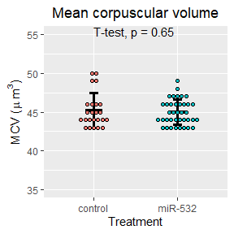

Let's begin by importing our data:


Next lets attach the different peripheral blood data together:

```
##   ï..Sample          Original.label Treatment Weeks.post.transplant WBC  RBC
## 1     MIG.1 BMT1.MIG (NEP cage 1/2)   control                     5 5.2 9.57
## 2     MIG.2 BMT1.MIG (REP cage 1/2)   control                     5 3.6 9.37
## 3     MIG.3 BMT1.MIG (BEP cage 2/2)   control                     5 6.5 9.58
## 4     MIG.4 BMT1.MIG (REP cage 2/2)   control                     5 6.2 9.74
## 5     MIG.5 BMT2.MIG (cage 2/2 BEP)   control                     5 4.5 9.84
## 6     MIG.6 BMT2.MIG (cage 2/2 LEP)   control                     5 3.0 9.83
##    HGB  HCT MCV  MCH MCHC PLT MPV  RDW Percent.Lym Percent.Mon Percent.Gra
## 1 14.7 45.7  48 15.4 32.2 473 6.8 15.7          NA          NA          NA
## 2 14.3 43.0  46 15.3 33.3 605 6.5 15.5          NA          NA          NA
## 3 14.6 44.4  46 15.3 32.9 453 6.7 15.3          NA          NA          NA
## 4 15.1 45.7  47 15.5 33.1 540 7.3 15.3          NA          NA          NA
## 5 14.6 45.8  46 14.9 32.0 631 6.5 16.0          NA          NA          NA
## 6 14.4 44.8  46 14.6 32.2 900 6.0 15.8          NA          NA          NA
##   Number.Lym Number.Mon Number.Gra  GFP
## 1        2.3        0.3        2.6 85.2
## 2        2.1        0.3        1.2 86.8
## 3        3.0        0.5        3.0 88.7
## 4        3.6        0.5        2.1 87.8
## 5        2.6        0.4        1.5 82.3
## 6        1.4        0.2        1.4 82.2
```

We will make a copy of the total data for manipulation:

What are the dimensions of our data?

```
## [1] 410  21
```

# Peripheral bleeds 11 weeks post-transplant:
Next we will filter for CBC data at 11 weeks post-transplant

```
##    ï..Sample          Original.label Treatment Weeks.post.transplant  WBC   RBC
## 84     MIG.1 BMT1.MIG (NEP cage 1/2)   control                    21   NA    NA
## 85     MIG.2 BMT1.MIG (REP cage 1/2)   control                    21   NA    NA
## 86     MIG.3 BMT1.MIG (BEP cage 2/2)   control                    21   NA    NA
## 87     MIG.4 BMT1.MIG (REP cage 2/2)   control                    21   NA    NA
## 88     MIG.5 BMT2.MIG (cage 2/2 BEP)   control                    21   NA    NA
## 89     MIG.6 BMT2.MIG (cage 2/2 LEP)   control                    21 13.2 10.67
##     HGB HCT MCV  MCH MCHC PLT MPV  RDW Percent.Lym Percent.Mon Percent.Gra
## 84   NA  NA  NA   NA   NA  NA  NA   NA          NA          NA          NA
## 85   NA  NA  NA   NA   NA  NA  NA   NA          NA          NA          NA
## 86   NA  NA  NA   NA   NA  NA  NA   NA          NA          NA          NA
## 87   NA  NA  NA   NA   NA  NA  NA   NA          NA          NA          NA
## 88   NA  NA  NA   NA   NA  NA  NA   NA          NA          NA          NA
## 89 15.3  47  44 14.3 32.4 739 6.3 15.6          NA          NA          NA
##    Number.Lym Number.Mon Number.Gra  GFP
## 84         NA         NA         NA   NA
## 85         NA         NA         NA   NA
## 86         NA         NA         NA   NA
## 87         NA         NA         NA   NA
## 88         NA         NA         NA   NA
## 89        6.4        1.1        5.7 60.1
```

Let's check the dimensions of our subsetted data:

```
## [1] 69 21
```

Let's make dotplots for our CBC counts:

<!-- -->


<!-- -->


<!-- -->


<!-- -->


<!-- -->


<!-- -->


<!-- -->

<!-- -->

<!-- -->

<!-- -->


<!-- -->


<!-- -->


<!-- -->


<!-- -->


<!-- -->


<!-- -->

<!-- -->


### Now let's arrange the plots:
#### Figure 1
<!-- -->

#### Figure 2
<!-- -->

### Notes
The four miR-532 mice with high granulocytes and lower peripheral blood engraftment (37-45% GFP+) at week 5:

At week5  
ID, GFP+ %, Lym, Mon, Gra  
miR532-29, 43.2,  1.8, 0.9, 7.5  
miR532-14, 45.5, 1.1, 0.3, 5.6  
miR532-30, 37.4, 2.0, 0.8, 4.3  
miR532-8, 44.3, 0.9, 0.2, 4.0  

At week11  
ID, GFP+ %, Lym, Mon, Gra  
miR532-29,  
miR532-14, 43.1, 3.0, 0.5, 5.8  
miR532-30,  
miR532-8, 55.0, 2.3, 0.4, 2.6   


## Now lets separate the data based on the transplanter:

We begin by joining the metadata to the week 11 CBC data


First, let's take a look at our statistics

```
## # A tibble: 1 x 8
##   term        group1   group2     estimate conf.low conf.high p.adj p.adj.signif
## * <chr>       <chr>    <chr>         <dbl>    <dbl>     <dbl> <dbl> <chr>       
## 1 Transplant~ Jeff.Lam Patrick.L~    -1.23    -2.87     0.412 0.138 ns
```

```
## # A tibble: 1 x 8
##   term      group1  group2   estimate conf.low conf.high      p.adj p.adj.signif
## * <chr>     <chr>   <chr>       <dbl>    <dbl>     <dbl>      <dbl> <chr>       
## 1 Transpla~ Jeff.L~ Patrick~     2.16     1.61      2.70    1.71e-9 ****
```

```
## # A tibble: 1 x 8
##   term       group1  group2    estimate conf.low conf.high    p.adj p.adj.signif
## * <chr>      <chr>   <chr>        <dbl>    <dbl>     <dbl>    <dbl> <chr>       
## 1 Transplan~ Jeff.L~ Patrick.~     1.58    0.940      2.22  1.53e-5 ****
```

```
## # A tibble: 1 x 8
##   term       group1  group2    estimate conf.low conf.high    p.adj p.adj.signif
## * <chr>      <chr>   <chr>        <dbl>    <dbl>     <dbl>    <dbl> <chr>       
## 1 Transplan~ Jeff.L~ Patrick.~     8.65     6.53      10.8 7.27e-10 ****
```

```
## # A tibble: 1 x 8
##   term        group1   group2    estimate conf.low conf.high  p.adj p.adj.signif
## * <chr>       <chr>    <chr>        <dbl>    <dbl>     <dbl>  <dbl> <chr>       
## 1 Transplant~ Jeff.Lam Patrick.~    -1.06    -2.11   -0.0112 0.0477 *
```

```
## # A tibble: 1 x 8
##   term      group1   group2   estimate conf.low conf.high     p.adj p.adj.signif
## * <chr>     <chr>    <chr>       <dbl>    <dbl>     <dbl>     <dbl> <chr>       
## 1 Transpla~ Jeff.Lam Patrick~    -1.41    -1.78     -1.04   4.70e-9 ****
```

```
## # A tibble: 1 x 8
##   term        group1   group2     estimate conf.low conf.high p.adj p.adj.signif
## * <chr>       <chr>    <chr>         <dbl>    <dbl>     <dbl> <dbl> <chr>       
## 1 Transplant~ Jeff.Lam Patrick.L~    -2.35    -2.63     -2.07     0 ****
```

```
## # A tibble: 1 x 8
##   term        group1   group2     estimate conf.low conf.high p.adj p.adj.signif
## * <chr>       <chr>    <chr>         <dbl>    <dbl>     <dbl> <dbl> <chr>       
## 1 Transplant~ Jeff.Lam Patrick.L~    -102.    -333.      130.  0.38 ns
```

```
## # A tibble: 1 x 8
##   term        group1   group2     estimate conf.low conf.high p.adj p.adj.signif
## * <chr>       <chr>    <chr>         <dbl>    <dbl>     <dbl> <dbl> <chr>       
## 1 Transplant~ Jeff.Lam Patrick.L~  -0.0500   -0.282     0.182 0.665 ns
```

```
## # A tibble: 1 x 8
##   term        group1   group2     estimate conf.low conf.high p.adj p.adj.signif
## * <chr>       <chr>    <chr>         <dbl>    <dbl>     <dbl> <dbl> <chr>       
## 1 Transplant~ Jeff.Lam Patrick.L~    0.151   -0.423     0.725 0.596 ns
```

```
## # A tibble: 1 x 8
##   term        group1   group2     estimate conf.low conf.high p.adj p.adj.signif
## * <chr>       <chr>    <chr>         <dbl>    <dbl>     <dbl> <dbl> <chr>       
## 1 Transplant~ Jeff.Lam Patrick.L~   -0.202    -1.10     0.694  0.65 ns
```

```
## # A tibble: 1 x 8
##   term        group1   group2    estimate conf.low conf.high  p.adj p.adj.signif
## * <chr>       <chr>    <chr>        <dbl>    <dbl>     <dbl>  <dbl> <chr>       
## 1 Transplant~ Jeff.Lam Patrick.~   -0.121   -0.232   -0.0110 0.0321 *
```

```
## # A tibble: 1 x 8
##   term        group1   group2    estimate conf.low conf.high  p.adj p.adj.signif
## * <chr>       <chr>    <chr>        <dbl>    <dbl>     <dbl>  <dbl> <chr>       
## 1 Transplant~ Jeff.Lam Patrick.~   -0.904    -1.84    0.0296 0.0573 ns
```

```
## # A tibble: 1 x 8
##   term        group1   group2     estimate conf.low conf.high p.adj p.adj.signif
## * <chr>       <chr>    <chr>         <dbl>    <dbl>     <dbl> <dbl> <chr>       
## 1 Transplant~ Jeff.Lam Patrick.L~    -7.67    -21.9      6.57 0.282 ns
```


```
## # A tibble: 1 x 8
##   term        group1   group2     estimate conf.low conf.high p.adj p.adj.signif
## * <chr>       <chr>    <chr>         <dbl>    <dbl>     <dbl> <dbl> <chr>       
## 1 Transplant~ Jeff.Lam Patrick.L~    -1.13    -4.46      2.21 0.491 ns
```

```
## # A tibble: 1 x 8
##   term       group1  group2    estimate conf.low conf.high    p.adj p.adj.signif
## * <chr>      <chr>   <chr>        <dbl>    <dbl>     <dbl>    <dbl> <chr>       
## 1 Transplan~ Jeff.L~ Patrick.~     2.15     1.34      2.96  1.64e-5 ****
```

```
## # A tibble: 1 x 8
##   term      group1   group2   estimate conf.low conf.high     p.adj p.adj.signif
## * <chr>     <chr>    <chr>       <dbl>    <dbl>     <dbl>     <dbl> <chr>       
## 1 Transpla~ Jeff.Lam Patrick~     2.38     1.64      3.11   9.36e-7 ****
```

```
## # A tibble: 1 x 8
##   term      group1   group2   estimate conf.low conf.high     p.adj p.adj.signif
## * <chr>     <chr>    <chr>       <dbl>    <dbl>     <dbl>     <dbl> <chr>       
## 1 Transpla~ Jeff.Lam Patrick~     10.8     8.19      13.4   1.71e-8 ****
```

```
## # A tibble: 1 x 8
##   term        group1   group2     estimate conf.low conf.high p.adj p.adj.signif
## * <chr>       <chr>    <chr>         <dbl>    <dbl>     <dbl> <dbl> <chr>       
## 1 Transplant~ Jeff.Lam Patrick.L~     1.39   -0.729      3.51 0.188 ns
```

```
## # A tibble: 1 x 8
##   term        group1   group2     estimate conf.low conf.high p.adj p.adj.signif
## * <chr>       <chr>    <chr>         <dbl>    <dbl>     <dbl> <dbl> <chr>       
## 1 Transplant~ Jeff.Lam Patrick.L~   -0.511    -1.27     0.251 0.178 ns
```

```
## # A tibble: 1 x 8
##   term       group1   group2   estimate conf.low conf.high    p.adj p.adj.signif
## * <chr>      <chr>    <chr>       <dbl>    <dbl>     <dbl>    <dbl> <chr>       
## 1 Transplan~ Jeff.Lam Patrick~    -1.98    -2.62     -1.34  1.88e-6 ****
```

```
## # A tibble: 1 x 8
##   term        group1   group2     estimate conf.low conf.high p.adj p.adj.signif
## * <chr>       <chr>    <chr>         <dbl>    <dbl>     <dbl> <dbl> <chr>       
## 1 Transplant~ Jeff.Lam Patrick.L~    -174.    -489.      140. 0.263 ns
```

```
## # A tibble: 1 x 8
##   term        group1   group2     estimate conf.low conf.high p.adj p.adj.signif
## * <chr>       <chr>    <chr>         <dbl>    <dbl>     <dbl> <dbl> <chr>       
## 1 Transplant~ Jeff.Lam Patrick.L~    0.417   -0.648      1.48 0.426 ns
```

```
## # A tibble: 1 x 8
##   term        group1   group2     estimate conf.low conf.high p.adj p.adj.signif
## * <chr>       <chr>    <chr>         <dbl>    <dbl>     <dbl> <dbl> <chr>       
## 1 Transplant~ Jeff.Lam Patrick.L~    0.661  -0.0990      1.42 0.085 ns
```

```
## # A tibble: 1 x 8
##   term        group1   group2     estimate conf.low conf.high p.adj p.adj.signif
## * <chr>       <chr>    <chr>         <dbl>    <dbl>     <dbl> <dbl> <chr>       
## 1 Transplant~ Jeff.Lam Patrick.L~    0.111    -1.59      1.81 0.894 ns
```

```
## # A tibble: 1 x 8
##   term        group1   group2     estimate conf.low conf.high p.adj p.adj.signif
## * <chr>       <chr>    <chr>         <dbl>    <dbl>     <dbl> <dbl> <chr>       
## 1 Transplant~ Jeff.Lam Patrick.L~   -0.106   -0.434     0.223 0.512 ns
```

```
## # A tibble: 1 x 8
##   term        group1   group2     estimate conf.low conf.high p.adj p.adj.signif
## * <chr>       <chr>    <chr>         <dbl>    <dbl>     <dbl> <dbl> <chr>       
## 1 Transplant~ Jeff.Lam Patrick.L~    -1.13    -2.89     0.624 0.195 ns
```

```
## # A tibble: 1 x 8
##   term       group1  group2    estimate conf.low conf.high    p.adj p.adj.signif
## * <chr>      <chr>   <chr>        <dbl>    <dbl>     <dbl>    <dbl> <chr>       
## 1 Transplan~ Jeff.L~ Patrick.~    -37.4    -53.2     -21.6  6.62e-5 ****
```


   


 


