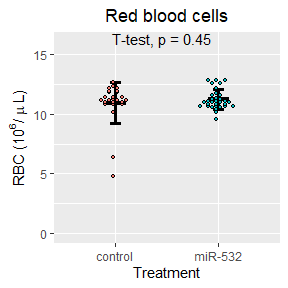
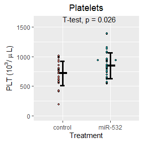
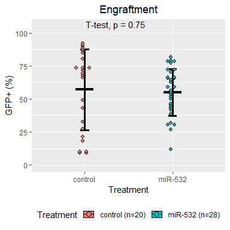
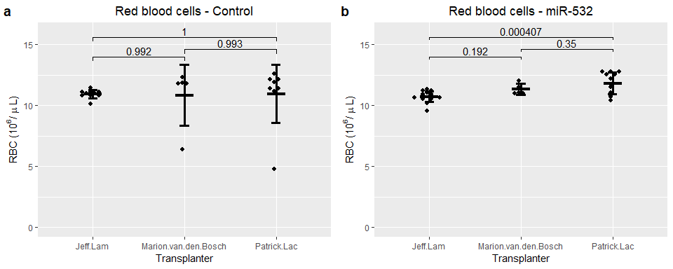
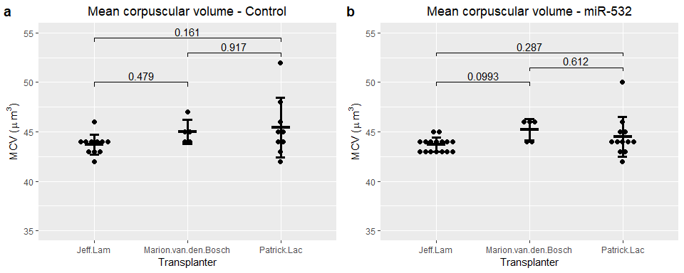
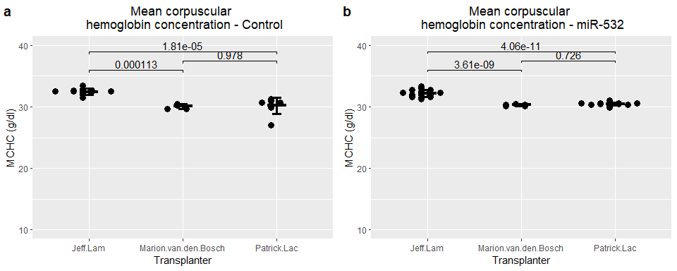
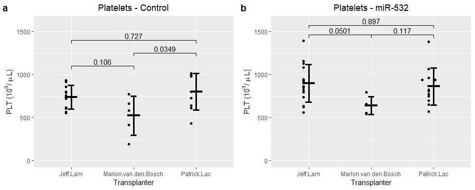
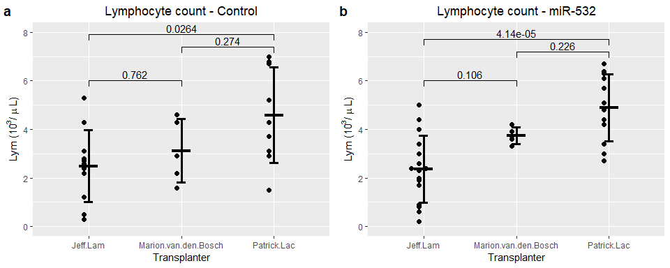
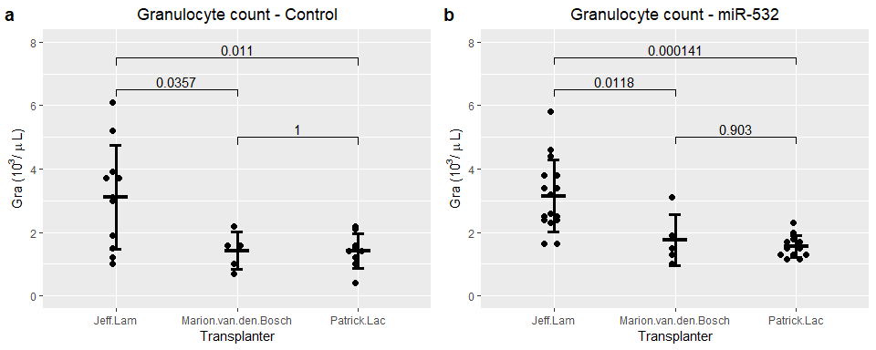

Let's begin by importing our data:


Next lets attach the different peripheral blood data together:

```
##   ï..Sample          Original.label Treatment Weeks.post.transplant WBC  RBC
## 1     MIG.1 BMT1.MIG (NEP cage 1/2)   control                     5 5.2 9.57
## 2     MIG.2 BMT1.MIG (REP cage 1/2)   control                     5 3.6 9.37
## 3     MIG.3 BMT1.MIG (BEP cage 2/2)   control                     5 6.5 9.58
## 4     MIG.4 BMT1.MIG (REP cage 2/2)   control                     5 6.2 9.74
## 5     MIG.5 BMT2.MIG (cage 2/2 BEP)   control                     5 4.5 9.84
## 6     MIG.6 BMT2.MIG (cage 2/2 LEP)   control                     5 3.0 9.83
##    HGB  HCT MCV  MCH MCHC PLT MPV  RDW Percent.Lym Percent.Mon Percent.Gra
## 1 14.7 45.7  48 15.4 32.2 473 6.8 15.7          NA          NA          NA
## 2 14.3 43.0  46 15.3 33.3 605 6.5 15.5          NA          NA          NA
## 3 14.6 44.4  46 15.3 32.9 453 6.7 15.3          NA          NA          NA
## 4 15.1 45.7  47 15.5 33.1 540 7.3 15.3          NA          NA          NA
## 5 14.6 45.8  46 14.9 32.0 631 6.5 16.0          NA          NA          NA
## 6 14.4 44.8  46 14.6 32.2 900 6.0 15.8          NA          NA          NA
##   Number.Lym Number.Mon Number.Gra  GFP
## 1        2.3        0.3        2.6 85.2
## 2        2.1        0.3        1.2 86.8
## 3        3.0        0.5        3.0 88.7
## 4        3.6        0.5        2.1 87.8
## 5        2.6        0.4        1.5 82.3
## 6        1.4        0.2        1.4 82.2
```

We will make a copy of the total data for manipulation:

What are the dimensions of our data?

```
## [1] 368  21
```

# Peripheral bleeds 11 weeks post-transplant:
Next we will filter for CBC data at 11 weeks post-transplant

```
##     ï..Sample          Original.label Treatment Weeks.post.transplant  WBC
## 28      MIG.1 BMT1.MIG (NEP cage 1/2)   control                    10  5.0
## 29      MIG.2 BMT1.MIG (REP cage 1/2)   control                    10 11.1
## 30      MIG.3 BMT1.MIG (BEP cage 2/2)   control                    10  3.4
## 31      MIG.4 BMT1.MIG (REP cage 2/2)   control                    10  3.8
## 234    MIG.12        MB_miR BMT_MIG_1   control                    10  4.3
## 235    MIG.13        MB_miR BMT_MIG_2   control                    10  6.5
##       RBC  HGB  HCT MCV  MCH MCHC PLT MPV  RDW Percent.Lym Percent.Mon
## 28  10.84 16.4 50.4  46 15.1 32.5 614 6.4 15.3          NA          NA
## 29  10.81 15.5 47.7  44 14.4 32.6 567 6.7 15.9          NA          NA
## 30  11.07 16.0 48.0  43 14.5 33.4 720 6.0 14.6          NA          NA
## 31  11.22 16.0 49.3  44 14.3 32.5 790 6.4 15.5          NA          NA
## 234 11.80 15.9 53.3  45 13.4 29.7 661 6.4 14.9        67.3         9.6
## 235 12.34 16.4 55.3  45 13.3 29.6 581 6.7 14.6        66.0         9.2
##     Percent.Gra Number.Lym Number.Mon Number.Gra   GFP
## 28           NA        3.1        0.4        1.5 86.70
## 29           NA        4.3        0.7        6.1 87.50
## 30           NA        2.2        0.2        1.0 88.90
## 31           NA        2.4        0.2        1.2 84.80
## 234        23.1        2.9        0.4        1.0 10.12
## 235        24.8        4.3        0.6        1.6  9.41
```

Let's check the dimensions of our subsetted data:

```
## [1] 58 21
```

Let's make dotplots for our CBC counts:

<!-- -->


<!-- -->


<!-- -->


<!-- -->


<!-- -->


<!-- -->


<!-- -->


<!-- -->


<!-- -->


<!-- -->


<!-- -->


<!-- -->


<!-- -->


<!-- -->


<!-- -->


<!-- -->

<!-- -->


### Now let's arrange the plots:
#### Figure 1
<!-- -->

#### Figure 2
<!-- -->

### Notes
The four miR-532 mice with high granulocytes and lower peripheral blood engraftment (37-45% GFP+) at week 5:

At week5  
ID, GFP+ %, Lym, Mon, Gra  
miR532-29, 43.2,  1.8, 0.9, 7.5  
miR532-14, 45.5, 1.1, 0.3, 5.6  
miR532-30, 37.4, 2.0, 0.8, 4.3  
miR532-8, 44.3, 0.9, 0.2, 4.0  

At week11  
ID, GFP+ %, Lym, Mon, Gra  
miR532-29,  
miR532-14, 43.1, 3.0, 0.5, 5.8  
miR532-30,  
miR532-8, 55.0, 2.3, 0.4, 2.6   


## Now lets separate the data based on the transplanter:

We begin by joining the metadata to the week 11 CBC data


First, let's take a look at our statistics

```
## # A tibble: 3 x 8
##   term     group1      group2     estimate conf.low conf.high p.adj p.adj.signif
## * <chr>    <chr>       <chr>         <dbl>    <dbl>     <dbl> <dbl> <chr>       
## 1 Transpl~ Jeff.Lam    Marion.va~   0.0625   -2.16       2.28 0.997 ns          
## 2 Transpl~ Jeff.Lam    Patrick.L~   1.09     -0.568      2.74 0.253 ns          
## 3 Transpl~ Marion.van~ Patrick.L~   1.03     -1.28       3.33 0.524 ns
```

```
## # A tibble: 3 x 8
##   term    group1     group2     estimate conf.low conf.high   p.adj p.adj.signif
## * <chr>   <chr>      <chr>         <dbl>    <dbl>     <dbl>   <dbl> <chr>       
## 1 Transp~ Jeff.Lam   Marion.va~    0.595   -0.227      1.42 1.92e-1 ns          
## 2 Transp~ Jeff.Lam   Patrick.L~    1.08     0.470      1.70 4.07e-4 ***         
## 3 Transp~ Marion.va~ Patrick.L~    0.487   -0.366      1.34 3.50e-1 ns
```

```
## # A tibble: 3 x 8
##   term    group1     group2     estimate conf.low conf.high   p.adj p.adj.signif
## * <chr>   <chr>      <chr>         <dbl>    <dbl>     <dbl>   <dbl> <chr>       
## 1 Transp~ Jeff.Lam   Marion.va~    0.340   -0.607      1.29 0.654   ns          
## 2 Transp~ Jeff.Lam   Patrick.L~    0.950    0.244      1.66 0.00654 **          
## 3 Transp~ Marion.va~ Patrick.L~    0.610   -0.374      1.59 0.292   ns
```

```
## # A tibble: 3 x 8
##   term    group1     group2     estimate conf.low conf.high   p.adj p.adj.signif
## * <chr>   <chr>      <chr>         <dbl>    <dbl>     <dbl>   <dbl> <chr>       
## 1 Transp~ Jeff.Lam   Marion.va~     4.12     1.05      7.19 6.69e-3 **          
## 2 Transp~ Jeff.Lam   Patrick.L~     5.72     3.44      8.01 2.55e-6 ****        
## 3 Transp~ Marion.va~ Patrick.L~     1.60    -1.58      4.79 4.39e-1 ns
```

```
## # A tibble: 3 x 8
##   term     group1     group2     estimate conf.low conf.high  p.adj p.adj.signif
## * <chr>    <chr>      <chr>         <dbl>    <dbl>     <dbl>  <dbl> <chr>       
## 1 Transpl~ Jeff.Lam   Marion.va~    1.51    -0.232      3.26 0.0993 ns          
## 2 Transpl~ Jeff.Lam   Patrick.L~    0.812   -0.488      2.11 0.287  ns          
## 3 Transpl~ Marion.va~ Patrick.L~   -0.700   -2.51       1.11 0.612  ns
```

```
## # A tibble: 3 x 8
##   term    group1     group2     estimate conf.low conf.high   p.adj p.adj.signif
## * <chr>   <chr>      <chr>         <dbl>    <dbl>     <dbl>   <dbl> <chr>       
## 1 Transp~ Jeff.Lam   Marion.va~   -0.421   -0.907    0.0645 0.0991  ns          
## 2 Transp~ Jeff.Lam   Patrick.L~   -0.481   -0.843   -0.119  0.00727 **          
## 3 Transp~ Marion.va~ Patrick.L~   -0.06    -0.565    0.445  0.954   ns
```

```
## # A tibble: 3 x 8
##   term    group1     group2    estimate conf.low conf.high    p.adj p.adj.signif
## * <chr>   <chr>      <chr>        <dbl>    <dbl>     <dbl>    <dbl> <chr>       
## 1 Transp~ Jeff.Lam   Marion.v~   -1.90    -2.44     -1.36  3.61e- 9 ****        
## 2 Transp~ Jeff.Lam   Patrick.~   -1.72    -2.13     -1.32  4.06e-11 ****        
## 3 Transp~ Marion.va~ Patrick.~    0.175   -0.388     0.738 7.26e- 1 ns
```

```
## # A tibble: 3 x 8
##   term     group1     group2     estimate conf.low conf.high  p.adj p.adj.signif
## * <chr>    <chr>      <chr>         <dbl>    <dbl>     <dbl>  <dbl> <chr>       
## 1 Transpl~ Jeff.Lam   Marion.va~   -259.    -517.      0.110 0.0501 ns          
## 2 Transpl~ Jeff.Lam   Patrick.L~    -34.8   -228.    158.    0.897  ns          
## 3 Transpl~ Marion.va~ Patrick.L~    224.     -45.0   493.    0.117  ns
```

```
## # A tibble: 3 x 8
##   term    group1     group2     estimate conf.low conf.high   p.adj p.adj.signif
## * <chr>   <chr>      <chr>         <dbl>    <dbl>     <dbl>   <dbl> <chr>       
## 1 Transp~ Jeff.Lam   Marion.va~  -0.0213  -1.72        1.67 0.999   ns          
## 2 Transp~ Jeff.Lam   Patrick.L~   1.76     0.497       3.02 0.00485 **          
## 3 Transp~ Marion.va~ Patrick.L~   1.78     0.0207      3.54 0.0469  *
```

```
## # A tibble: 3 x 8
##   term     group1     group2     estimate conf.low conf.high  p.adj p.adj.signif
## * <chr>    <chr>      <chr>         <dbl>    <dbl>     <dbl>  <dbl> <chr>       
## 1 Transpl~ Jeff.Lam   Marion.va~   -259.    -517.      0.110 0.0501 ns          
## 2 Transpl~ Jeff.Lam   Patrick.L~    -34.8   -228.    158.    0.897  ns          
## 3 Transpl~ Marion.va~ Patrick.L~    224.     -45.0   493.    0.117  ns
```

```
## # A tibble: 3 x 8
##   term    group1     group2     estimate conf.low conf.high   p.adj p.adj.signif
## * <chr>   <chr>      <chr>         <dbl>    <dbl>     <dbl>   <dbl> <chr>       
## 1 Transp~ Jeff.Lam   Marion.va~     1.39   -0.240      3.02 1.06e-1 ns          
## 2 Transp~ Jeff.Lam   Patrick.L~     2.55    1.34       3.76 4.14e-5 ****        
## 3 Transp~ Marion.va~ Patrick.L~     1.16   -0.533      2.85 2.26e-1 ns
```

```
## # A tibble: 3 x 8
##   term     group1      group2     estimate conf.low conf.high p.adj p.adj.signif
## * <chr>    <chr>       <chr>         <dbl>    <dbl>     <dbl> <dbl> <chr>       
## 1 Transpl~ Jeff.Lam    Marion.va~   0.0625  -0.129      0.254 0.702 ns          
## 2 Transpl~ Jeff.Lam    Patrick.L~   0.104   -0.0383     0.247 0.186 ns          
## 3 Transpl~ Marion.van~ Patrick.L~   0.0417  -0.157      0.240 0.863 ns
```

```
## # A tibble: 3 x 8
##   term    group1     group2     estimate conf.low conf.high   p.adj p.adj.signif
## * <chr>   <chr>      <chr>         <dbl>    <dbl>     <dbl>   <dbl> <chr>       
## 1 Transp~ Jeff.Lam   Marion.va~   -1.39     -2.50    -0.279 1.18e-2 *           
## 2 Transp~ Jeff.Lam   Patrick.L~   -1.59     -2.42    -0.763 1.41e-4 ***         
## 3 Transp~ Marion.va~ Patrick.L~   -0.202    -1.36     0.953 9.03e-1 ns
```

```
## # A tibble: 3 x 8
##   term    group1     group2     estimate conf.low conf.high   p.adj p.adj.signif
## * <chr>   <chr>      <chr>         <dbl>    <dbl>     <dbl>   <dbl> <chr>       
## 1 Transp~ Jeff.Lam   Marion.va~   -30.0    -48.6     -11.3  0.00121 **          
## 2 Transp~ Jeff.Lam   Patrick.L~    -8.73   -22.6       5.17 0.284   ns          
## 3 Transp~ Marion.va~ Patrick.L~    21.2      1.85     40.6  0.0295  *
```


```
## # A tibble: 3 x 8
##   term     group1      group2     estimate conf.low conf.high p.adj p.adj.signif
## * <chr>    <chr>       <chr>         <dbl>    <dbl>     <dbl> <dbl> <chr>       
## 1 Transpl~ Jeff.Lam    Marion.va~   -1.12     -4.75      2.50 0.72  ns          
## 2 Transpl~ Jeff.Lam    Patrick.L~    0.396    -2.62      3.42 0.942 ns          
## 3 Transpl~ Marion.van~ Patrick.L~    1.52     -2.23      5.27 0.574 ns
```

```
## # A tibble: 3 x 8
##   term     group1      group2     estimate conf.low conf.high p.adj p.adj.signif
## * <chr>    <chr>       <chr>         <dbl>    <dbl>     <dbl> <dbl> <chr>       
## 1 Transpl~ Jeff.Lam    Marion.va~ -0.117      -2.56      2.32 0.992 ns          
## 2 Transpl~ Jeff.Lam    Patrick.L~ -0.00212    -2.04      2.03 1     ns          
## 3 Transpl~ Marion.van~ Patrick.L~  0.115      -2.41      2.64 0.993 ns
```

```
## # A tibble: 3 x 8
##   term     group1      group2     estimate conf.low conf.high p.adj p.adj.signif
## * <chr>    <chr>       <chr>         <dbl>    <dbl>     <dbl> <dbl> <chr>       
## 1 Transpl~ Jeff.Lam    Marion.va~   -0.858    -4.20      2.48 0.797 ns          
## 2 Transpl~ Jeff.Lam    Patrick.L~   -0.552    -3.34      2.23 0.873 ns          
## 3 Transpl~ Marion.van~ Patrick.L~    0.307    -3.15      3.76 0.973 ns
```

```
## # A tibble: 3 x 8
##   term     group1      group2     estimate conf.low conf.high p.adj p.adj.signif
## * <chr>    <chr>       <chr>         <dbl>    <dbl>     <dbl> <dbl> <chr>       
## 1 Transpl~ Jeff.Lam    Marion.va~    0.885    -9.53      11.3 0.975 ns          
## 2 Transpl~ Jeff.Lam    Patrick.L~    1.38     -7.30      10.1 0.916 ns          
## 3 Transpl~ Marion.van~ Patrick.L~    0.493   -10.3       11.3 0.993 ns
```

```
## # A tibble: 3 x 8
##   term     group1      group2     estimate conf.low conf.high p.adj p.adj.signif
## * <chr>    <chr>       <chr>         <dbl>    <dbl>     <dbl> <dbl> <chr>       
## 1 Transpl~ Jeff.Lam    Marion.va~    1.27    -1.44       3.99 0.479 ns          
## 2 Transpl~ Jeff.Lam    Patrick.L~    1.72    -0.546      3.98 0.161 ns          
## 3 Transpl~ Marion.van~ Patrick.L~    0.444   -2.36       3.25 0.917 ns
```

```
## # A tibble: 3 x 8
##   term     group1     group2     estimate conf.low conf.high  p.adj p.adj.signif
## * <chr>    <chr>      <chr>         <dbl>    <dbl>     <dbl>  <dbl> <chr>       
## 1 Transpl~ Jeff.Lam   Marion.va~   -0.700   -1.31   -0.0927  0.022  *           
## 2 Transpl~ Jeff.Lam   Patrick.L~   -0.5     -1.01    0.00609 0.0532 ns          
## 3 Transpl~ Marion.va~ Patrick.L~    0.200   -0.428   0.828   0.707  ns
```

```
## # A tibble: 3 x 8
##   term    group1     group2     estimate conf.low conf.high   p.adj p.adj.signif
## * <chr>   <chr>      <chr>         <dbl>    <dbl>     <dbl>   <dbl> <chr>       
## 1 Transp~ Jeff.Lam   Marion.va~  -2.38      -3.55     -1.21 1.13e-4 ***         
## 2 Transp~ Jeff.Lam   Patrick.L~  -2.29      -3.26     -1.31 1.81e-5 ****        
## 3 Transp~ Marion.va~ Patrick.L~   0.0978    -1.11      1.31 9.78e-1 ns
```

```
## # A tibble: 3 x 8
##   term     group1     group2     estimate conf.low conf.high  p.adj p.adj.signif
## * <chr>    <chr>      <chr>         <dbl>    <dbl>     <dbl>  <dbl> <chr>       
## 1 Transpl~ Jeff.Lam   Marion.va~   -214.    -465.       37.6 0.106  ns          
## 2 Transpl~ Jeff.Lam   Patrick.L~     63.8   -146.      273.  0.727  ns          
## 3 Transpl~ Marion.va~ Patrick.L~    278.      17.6     537.  0.0349 *
```

```
## # A tibble: 3 x 8
##   term    group1     group2     estimate conf.low conf.high   p.adj p.adj.signif
## * <chr>   <chr>      <chr>         <dbl>    <dbl>     <dbl>   <dbl> <chr>       
## 1 Transp~ Jeff.Lam   Marion.va~ -0.00909   -1.40       1.38 1       ns          
## 2 Transp~ Jeff.Lam   Patrick.L~  1.69       0.535      2.85 0.00366 **          
## 3 Transp~ Marion.va~ Patrick.L~  1.70       0.265      3.13 0.0184  *
```

```
## # A tibble: 3 x 8
##   term     group1     group2     estimate conf.low conf.high  p.adj p.adj.signif
## * <chr>    <chr>      <chr>         <dbl>    <dbl>     <dbl>  <dbl> <chr>       
## 1 Transpl~ Jeff.Lam   Marion.va~   -214.    -465.       37.6 0.106  ns          
## 2 Transpl~ Jeff.Lam   Patrick.L~     63.8   -146.      273.  0.727  ns          
## 3 Transpl~ Marion.va~ Patrick.L~    278.      17.6     537.  0.0349 *
```

```
## # A tibble: 3 x 8
##   term     group1     group2     estimate conf.low conf.high  p.adj p.adj.signif
## * <chr>    <chr>      <chr>         <dbl>    <dbl>     <dbl>  <dbl> <chr>       
## 1 Transpl~ Jeff.Lam   Marion.va~    0.629   -1.61       2.87 0.762  ns          
## 2 Transpl~ Jeff.Lam   Patrick.L~    2.09     0.222      3.95 0.0264 *           
## 3 Transpl~ Marion.va~ Patrick.L~    1.46    -0.856      3.77 0.274  ns
```

```
## # A tibble: 3 x 8
##   term     group1      group2     estimate conf.low conf.high p.adj p.adj.signif
## * <chr>    <chr>       <chr>         <dbl>    <dbl>     <dbl> <dbl> <chr>       
## 1 Transpl~ Jeff.Lam    Marion.va~ -0.0527    -0.375     0.270 0.912 ns          
## 2 Transpl~ Jeff.Lam    Patrick.L~  0.00505   -0.264     0.274 0.999 ns          
## 3 Transpl~ Marion.van~ Patrick.L~  0.0578    -0.276     0.391 0.901 ns
```

```
## # A tibble: 3 x 8
##   term     group1     group2     estimate conf.low conf.high  p.adj p.adj.signif
## * <chr>    <chr>      <chr>         <dbl>    <dbl>     <dbl>  <dbl> <chr>       
## 1 Transpl~ Jeff.Lam   Marion.va~ -1.70       -3.29    -0.102 0.0357 *           
## 2 Transpl~ Jeff.Lam   Patrick.L~ -1.70       -3.03    -0.366 0.011  *           
## 3 Transpl~ Marion.va~ Patrick.L~  0.00222    -1.65     1.65  1      ns
```

```
## # A tibble: 3 x 8
##   term    group1     group2    estimate conf.low conf.high    p.adj p.adj.signif
## * <chr>   <chr>      <chr>        <dbl>    <dbl>     <dbl>    <dbl> <chr>       
## 1 Transp~ Jeff.Lam   Marion.v~    -69.4    -91.2     -47.5  1.81e-7 ****        
## 2 Transp~ Jeff.Lam   Patrick.~    -28.7    -46.9     -10.5  1.86e-3 **          
## 3 Transp~ Marion.va~ Patrick.~     40.7     18.1      63.3  4.71e-4 ***
```

Now let's make dot plots for the CBC data by transplanter


<!-- --><!-- --><!-- --><!-- --><!-- --><!-- --><!-- --><!-- --><!-- --><!-- --><!-- --><!-- --><!-- --><!-- -->


