Let's begin by importing our data:


Next lets attach the different peripheral blood data together:

```
##   ï..Sample          Original.label Treatment Weeks.post.transplant WBC  RBC
## 1     MIG.1 BMT1.MIG (NEP cage 1/2)   control                     5 5.2 9.57
## 2     MIG.2 BMT1.MIG (REP cage 1/2)   control                     5 3.6 9.37
## 3     MIG.3 BMT1.MIG (BEP cage 2/2)   control                     5 6.5 9.58
## 4     MIG.4 BMT1.MIG (REP cage 2/2)   control                     5 6.2 9.74
## 5     MIG.5 BMT2.MIG (cage 2/2 BEP)   control                     5 4.5 9.84
## 6     MIG.6 BMT2.MIG (cage 2/2 LEP)   control                     5 3.0 9.83
##    HGB  HCT MCV  MCH MCHC PLT MPV  RDW Percent.Lym Percent.Mon Percent.Gra
## 1 14.7 45.7  48 15.4 32.2 473 6.8 15.7          NA          NA          NA
## 2 14.3 43.0  46 15.3 33.3 605 6.5 15.5          NA          NA          NA
## 3 14.6 44.4  46 15.3 32.9 453 6.7 15.3          NA          NA          NA
## 4 15.1 45.7  47 15.5 33.1 540 7.3 15.3          NA          NA          NA
## 5 14.6 45.8  46 14.9 32.0 631 6.5 16.0          NA          NA          NA
## 6 14.4 44.8  46 14.6 32.2 900 6.0 15.8          NA          NA          NA
##   Number.Lym Number.Mon Number.Gra  GFP
## 1        2.3        0.3        2.6 85.2
## 2        2.1        0.3        1.2 86.8
## 3        3.0        0.5        3.0 88.7
## 4        3.6        0.5        2.1 87.8
## 5        2.6        0.4        1.5 82.3
## 6        1.4        0.2        1.4 82.2
```

We will make a copy of the total data for manipulation:

What are the dimensions of our data?

```
## [1] 368  21
```

# Peripheral bleeds 11 weeks post-transplant:
Next we will filter for CBC data at 11 weeks post-transplant

```
##     ï..Sample          Original.label Treatment Weeks.post.transplant  WBC
## 28      MIG.1 BMT1.MIG (NEP cage 1/2)   control                    10  5.0
## 29      MIG.2 BMT1.MIG (REP cage 1/2)   control                    10 11.1
## 30      MIG.3 BMT1.MIG (BEP cage 2/2)   control                    10  3.4
## 31      MIG.4 BMT1.MIG (REP cage 2/2)   control                    10  3.8
## 234    MIG.12        MB_miR BMT_MIG_1   control                    10  4.3
## 235    MIG.13        MB_miR BMT_MIG_2   control                    10  6.5
##       RBC  HGB  HCT MCV  MCH MCHC PLT MPV  RDW Percent.Lym Percent.Mon
## 28  10.84 16.4 50.4  46 15.1 32.5 614 6.4 15.3          NA          NA
## 29  10.81 15.5 47.7  44 14.4 32.6 567 6.7 15.9          NA          NA
## 30  11.07 16.0 48.0  43 14.5 33.4 720 6.0 14.6          NA          NA
## 31  11.22 16.0 49.3  44 14.3 32.5 790 6.4 15.5          NA          NA
## 234 11.80 15.9 53.3  45 13.4 29.7 661 6.4 14.9        67.3         9.6
## 235 12.34 16.4 55.3  45 13.3 29.6 581 6.7 14.6        66.0         9.2
##     Percent.Gra Number.Lym Number.Mon Number.Gra   GFP
## 28           NA        3.1        0.4        1.5 86.70
## 29           NA        4.3        0.7        6.1 87.50
## 30           NA        2.2        0.2        1.0 88.90
## 31           NA        2.4        0.2        1.2 84.80
## 234        23.1        2.9        0.4        1.0 10.12
## 235        24.8        4.3        0.6        1.6  9.41
```

Let's check the dimensions of our subsetted data:

```
## [1] 58 21
```

Let's make dotplots for our CBC counts:

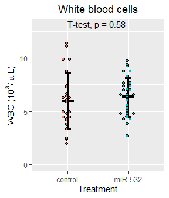<!-- -->


<!-- -->


<!-- -->


<!-- -->


<!-- -->


<!-- -->


<!-- -->


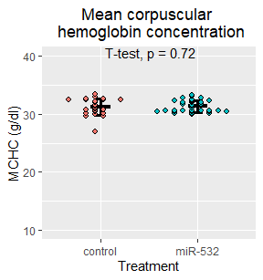<!-- -->


<!-- -->


<!-- -->


<!-- -->


<!-- -->


<!-- -->


<!-- -->


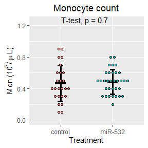<!-- -->


<!-- -->

<!-- -->


### Now let's arrange the plots:
#### Figure 1
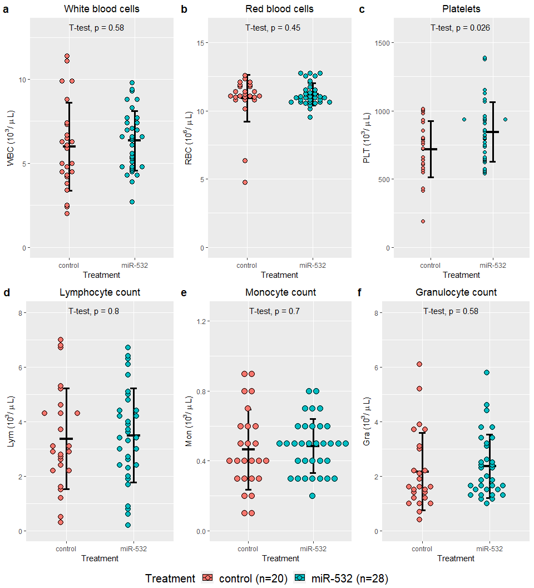<!-- -->

#### Figure 2
<!-- -->

### Notes
The four miR-532 mice with high granulocytes and lower peripheral blood engraftment (37-45% GFP+) at week 5:

At week5  
ID, GFP+ %, Lym, Mon, Gra  
miR532-29, 43.2,  1.8, 0.9, 7.5  
miR532-14, 45.5, 1.1, 0.3, 5.6  
miR532-30, 37.4, 2.0, 0.8, 4.3  
miR532-8, 44.3, 0.9, 0.2, 4.0  

At week11  
ID, GFP+ %, Lym, Mon, Gra  
miR532-29,  
miR532-14, 43.1, 3.0, 0.5, 5.8  
miR532-30,  
miR532-8, 55.0, 2.3, 0.4, 2.6   


## Now lets separate the data based on the transplanter:

We begin by joining the metadata to the week 11 CBC data


Now let's make dot plots for the CBC data by transplanter


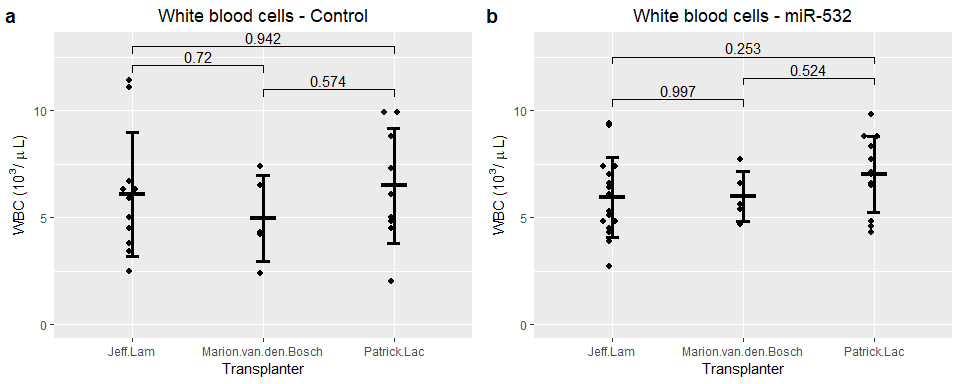<!-- --><!-- -->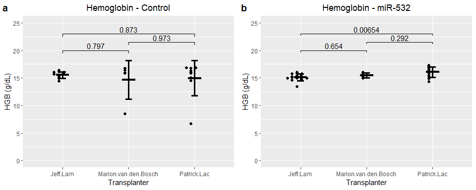<!-- -->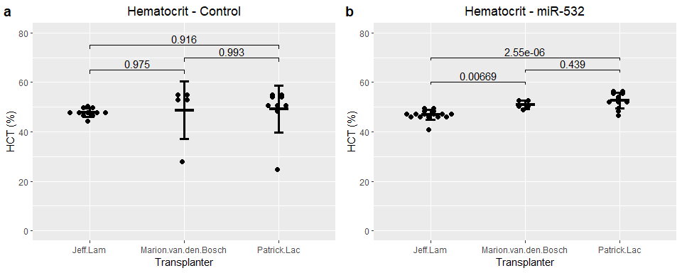<!-- --><!-- --><!-- --><!-- --><!-- -->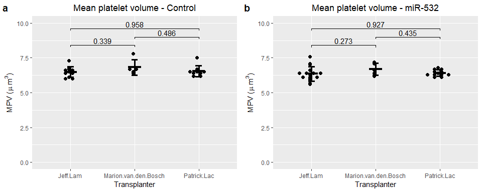<!-- -->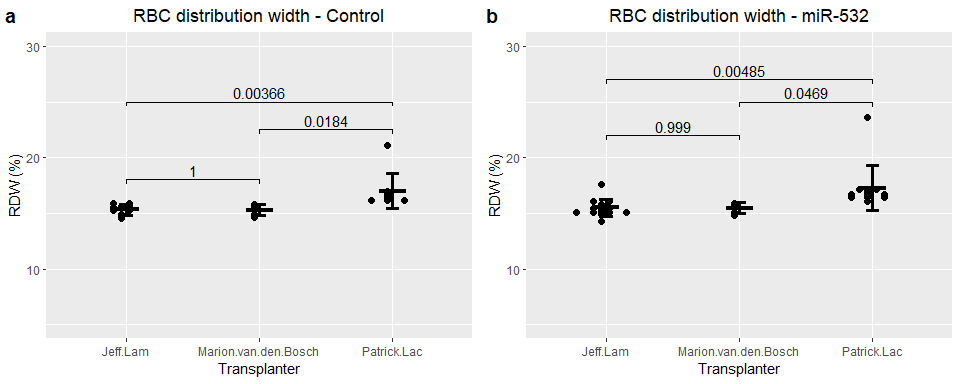<!-- --><!-- -->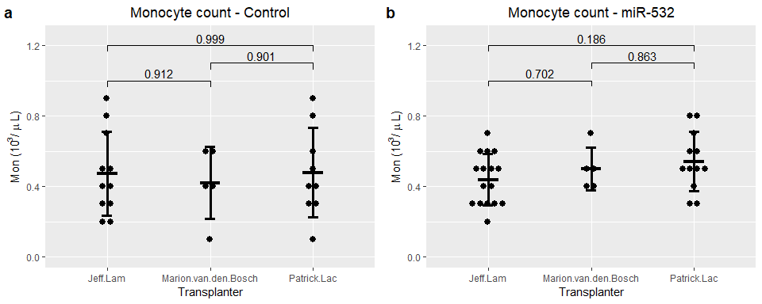<!-- --><!-- -->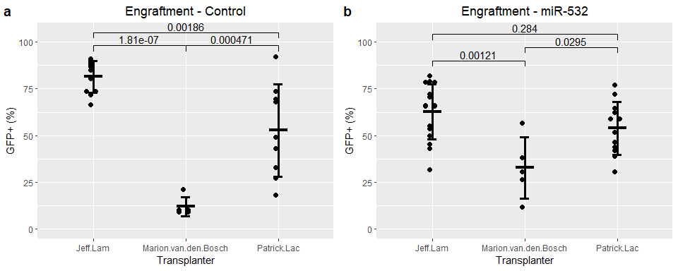<!-- -->

```
##   Tukey multiple comparisons of means
##     95% family-wise confidence level
## 
## Fit: aov(formula = WBC ~ Transplant.performed.by., data = all.control)
## 
## $Transplant.performed.by.
##                                         diff       lwr      upr     p adj
## Marion.van.den.Bosch -Jeff.Lam    -1.1218182 -4.745503 2.501867 0.7203266
## Patrick.Lac-Jeff.Lam               0.3959596 -2.623778 3.415697 0.9421021
## Patrick.Lac-Marion.van.den.Bosch   1.5177778 -2.229618 5.265173 0.5739565
```

```
##   Tukey multiple comparisons of means
##     95% family-wise confidence level
## 
## Fit: aov(formula = RBC ~ Transplant.performed.by., data = all.control)
## 
## $Transplant.performed.by.
##                                           diff       lwr      upr     p adj
## Marion.van.den.Bosch -Jeff.Lam    -0.117454545 -2.557663 2.322754 0.9919752
## Patrick.Lac-Jeff.Lam              -0.002121212 -2.035628 2.031386 0.9999962
## Patrick.Lac-Marion.van.den.Bosch   0.115333333 -2.408183 2.638849 0.9927617
```

```
##   Tukey multiple comparisons of means
##     95% family-wise confidence level
## 
## Fit: aov(formula = HGB ~ Transplant.performed.by., data = all.control)
## 
## $Transplant.performed.by.
##                                         diff       lwr      upr     p adj
## Marion.van.den.Bosch -Jeff.Lam    -0.8581818 -4.200166 2.483802 0.7970440
## Patrick.Lac-Jeff.Lam              -0.5515152 -3.336502 2.233472 0.8732576
## Patrick.Lac-Marion.van.den.Bosch   0.3066667 -3.149411 3.762744 0.9730151
```

```
##   Tukey multiple comparisons of means
##     95% family-wise confidence level
## 
## Fit: aov(formula = HCT ~ Transplant.performed.by., data = all.control)
## 
## $Transplant.performed.by.
##                                        diff        lwr      upr     p adj
## Marion.van.den.Bosch -Jeff.Lam    0.8854545  -9.534995 11.30590 0.9752227
## Patrick.Lac-Jeff.Lam              1.3787879  -7.304920 10.06250 0.9163728
## Patrick.Lac-Marion.van.den.Bosch  0.4933333 -10.282865 11.26953 0.9927376
```

```
##   Tukey multiple comparisons of means
##     95% family-wise confidence level
## 
## Fit: aov(formula = MCV ~ Transplant.performed.by., data = all.control)
## 
## $Transplant.performed.by.
##                                        diff        lwr      upr     p adj
## Marion.van.den.Bosch -Jeff.Lam    1.2727273 -1.4432987 3.988753 0.4787811
## Patrick.Lac-Jeff.Lam              1.7171717 -0.5461833 3.980527 0.1606829
## Patrick.Lac-Marion.van.den.Bosch  0.4444444 -2.3643052 3.253194 0.9169171
```

```
##   Tukey multiple comparisons of means
##     95% family-wise confidence level
## 
## Fit: aov(formula = MCH ~ Transplant.performed.by., data = all.control)
## 
## $Transplant.performed.by.
##                                   diff        lwr          upr     p adj
## Marion.van.den.Bosch -Jeff.Lam    -0.7 -1.3073080 -0.092692010 0.0219676
## Patrick.Lac-Jeff.Lam              -0.5 -1.0060900  0.006089992 0.0532226
## Patrick.Lac-Marion.van.den.Bosch   0.2 -0.4280412  0.828041163 0.7069485
```

```
##   Tukey multiple comparisons of means
##     95% family-wise confidence level
## 
## Fit: aov(formula = MCHC ~ Transplant.performed.by., data = all.control)
## 
## $Transplant.performed.by.
##                                          diff       lwr       upr     p adj
## Marion.van.den.Bosch -Jeff.Lam    -2.38363636 -3.553066 -1.214206 0.0001127
## Patrick.Lac-Jeff.Lam              -2.28585859 -3.260384 -1.311334 0.0000181
## Patrick.Lac-Marion.van.den.Bosch   0.09777778 -1.111576  1.307131 0.9775388
```

```
##   Tukey multiple comparisons of means
##     95% family-wise confidence level
## 
## Fit: aov(formula = PLT ~ Transplant.performed.by., data = all.control)
## 
## $Transplant.performed.by.
##                                         diff        lwr       upr     p adj
## Marion.van.den.Bosch -Jeff.Lam    -213.67273 -464.95714  37.61168 0.1055221
## Patrick.Lac-Jeff.Lam                63.83838 -145.56529 273.24206 0.7274026
## Patrick.Lac-Marion.van.den.Bosch   277.51111   17.64799 537.37424 0.0349046
```

```
##   Tukey multiple comparisons of means
##     95% family-wise confidence level
## 
## Fit: aov(formula = RDW ~ Transplant.performed.by., data = all.control)
## 
## $Transplant.performed.by.
##                                           diff        lwr      upr     p adj
## Marion.van.den.Bosch -Jeff.Lam    -0.009090909 -1.3965274 1.378346 0.9998506
## Patrick.Lac-Jeff.Lam               1.690909091  0.5347120 2.847106 0.0036592
## Patrick.Lac-Marion.van.den.Bosch   1.700000000  0.2651972 3.134803 0.0183529
```

```
##   Tukey multiple comparisons of means
##     95% family-wise confidence level
## 
## Fit: aov(formula = PLT ~ Transplant.performed.by., data = all.control)
## 
## $Transplant.performed.by.
##                                         diff        lwr       upr     p adj
## Marion.van.den.Bosch -Jeff.Lam    -213.67273 -464.95714  37.61168 0.1055221
## Patrick.Lac-Jeff.Lam                63.83838 -145.56529 273.24206 0.7274026
## Patrick.Lac-Marion.van.den.Bosch   277.51111   17.64799 537.37424 0.0349046
```

```
##   Tukey multiple comparisons of means
##     95% family-wise confidence level
## 
## Fit: aov(formula = Number.Lym ~ Transplant.performed.by., data = all.control)
## 
## $Transplant.performed.by.
##                                        diff        lwr      upr     p adj
## Marion.van.den.Bosch -Jeff.Lam    0.6290909 -1.6086987 2.866881 0.7624067
## Patrick.Lac-Jeff.Lam              2.0868687  0.2220440 3.951693 0.0264377
## Patrick.Lac-Marion.van.den.Bosch  1.4577778 -0.8564088 3.771964 0.2740424
```

```
##   Tukey multiple comparisons of means
##     95% family-wise confidence level
## 
## Fit: aov(formula = Number.Mon ~ Transplant.performed.by., data = all.control)
## 
## $Transplant.performed.by.
##                                           diff        lwr       upr     p adj
## Marion.van.den.Bosch -Jeff.Lam    -0.052727273 -0.3750921 0.2696376 0.9115117
## Patrick.Lac-Jeff.Lam               0.005050505 -0.2635869 0.2736879 0.9987711
## Patrick.Lac-Marion.van.den.Bosch   0.057777778 -0.2755925 0.3911480 0.9012544
```

```
##   Tukey multiple comparisons of means
##     95% family-wise confidence level
## 
## Fit: aov(formula = Number.Gra ~ Transplant.performed.by., data = all.control)
## 
## $Transplant.performed.by.
##                                           diff       lwr        upr     p adj
## Marion.van.den.Bosch -Jeff.Lam    -1.698181818 -3.294545 -0.1018183 0.0356875
## Patrick.Lac-Jeff.Lam              -1.695959596 -3.026263 -0.3656566 0.0109992
## Patrick.Lac-Marion.van.den.Bosch   0.002222222 -1.648640  1.6530848 0.9999937
```


```
##                          Df Sum Sq Mean Sq F value Pr(>F)
## Transplant.performed.by.  2   0.05   0.027   0.008  0.992
## Residuals                22  71.36   3.244
```

```
##   Tukey multiple comparisons of means
##     95% family-wise confidence level
## 
## Fit: aov(formula = RBC ~ Transplant.performed.by., data = all.control)
## 
## $Transplant.performed.by.
##                                           diff       lwr      upr     p adj
## Marion.van.den.Bosch -Jeff.Lam    -0.117454545 -2.557663 2.322754 0.9919752
## Patrick.Lac-Jeff.Lam              -0.002121212 -2.035628 2.031386 0.9999962
## Patrick.Lac-Marion.van.den.Bosch   0.115333333 -2.408183 2.638849 0.9927617
```

<!-- -->
